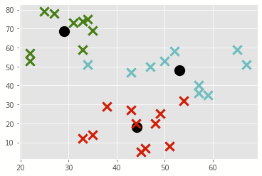

_Exercise assignment for the course [Unsupervised and Reinforcement Learning (AAI-URL)](https://inf-git.fh-rosenheim.de/aai-url/hsro-aai-url-github-io) in the [Bachelor of AAI](https://www.th-rosenheim.de/en/technology/computer-science-mathematics/applied-artificial-intelligence-bachelors-degree) at [Rosenheim University of Applied Sciences](http://www.th-rosenheim.de)_

# Assigment 00 - Setup, Python and k-means

## Task 0 - Python environment setup (in case you wanna run it locally!)

Install a Python environment on your computer. This environment should be able to run both Python processes and Jupyter notebooks.

As a recommendation, use [Anconda](https://www.anaconda.com). Follow the installation guidelines on the website.
1. Download from here: https://www.anaconda.com/products/distribution#Downloads
2. Install
3. Validate the installtion:
  - Test open the CMD REPL by typing
  ```
  >python3
  Python 3.6.9 (default, Oct  8 2020, 12:12:24)
  [GCC 8.4.0] on linux
  Type "help", "copyright", "credits" or "license" for more information.
  >>>
  ```
  - Create a jupyter notebook by starting
  ```
  >jupyter-notebook
  ``` 

## Task 1 - k-means on paper

a)

Given is the following list of points (dataset):

```python
data = [[0,0], [0,1], [-1,2], [2,0], [3,0], [4,-1]]
```

1. Compute the (squared) distance matrix.
2. Perform K-means clustering on the dataset using the **out-of-set variant**. Use the first and last datapoints as initial centers (K = 2). (2 Iterations)

b)

Validate your results by writing k-means in Python.

1. Calculate the squared distance matrix.
2. Run the k-means algo on dataset. Compare results with a).

## Task 2 - k-means with Python lib

a)

Given ist the following dataset:

```python
data = {'x': [25,34,22,27,33,33,31,22,35,34,67,54,57,43,50,57,59,52,65,47,49,48,35,33,44,45,38,43,51,46],
        'y': [79,51,53,78,59,74,73,57,69,75,51,32,40,47,53,36,35,58,59,50,25,20,14,12,20,5,29,27,8,7]
       }
```

Convert it into a 2-d numpy array so that you can use the k-means algo from the lecture.

b)

Plot the data by using the plotting code from lecture.

c)

Calculate the k-means for k=3 by using the code from lecture.

The result can look like this:



d)

Which values do your centroid have?

Here is what I got: `[29.11111111, 68.55555556], [44.18181818, 18.09090909], [53.1, 48. ]`


